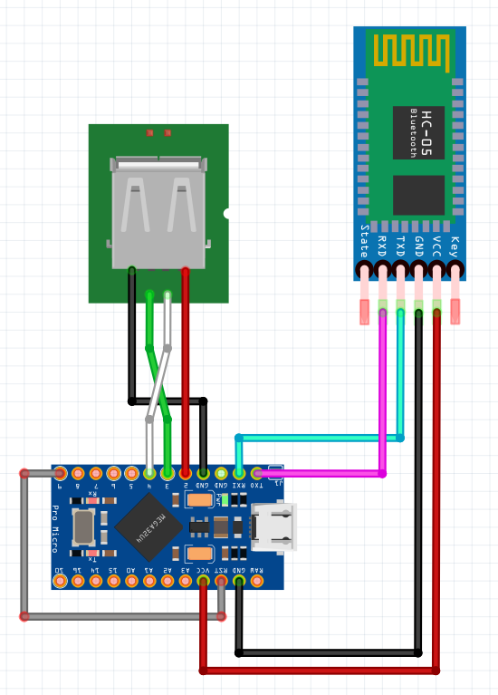
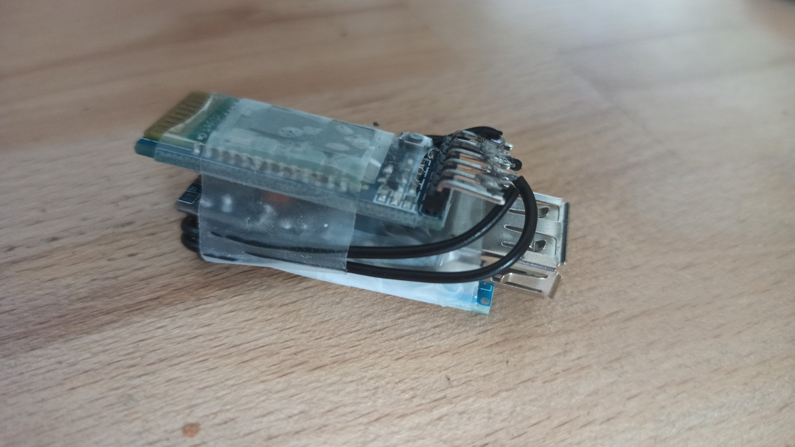
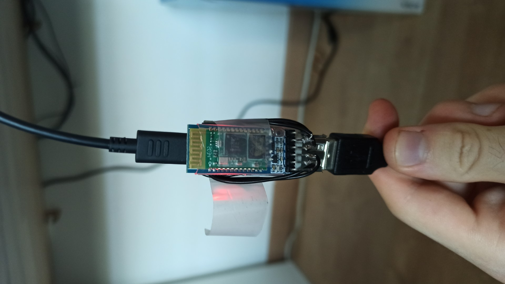
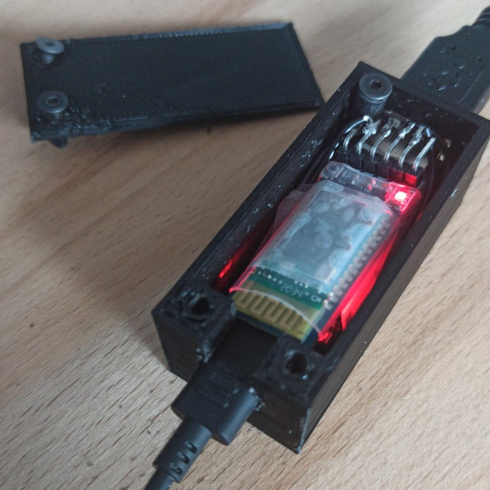
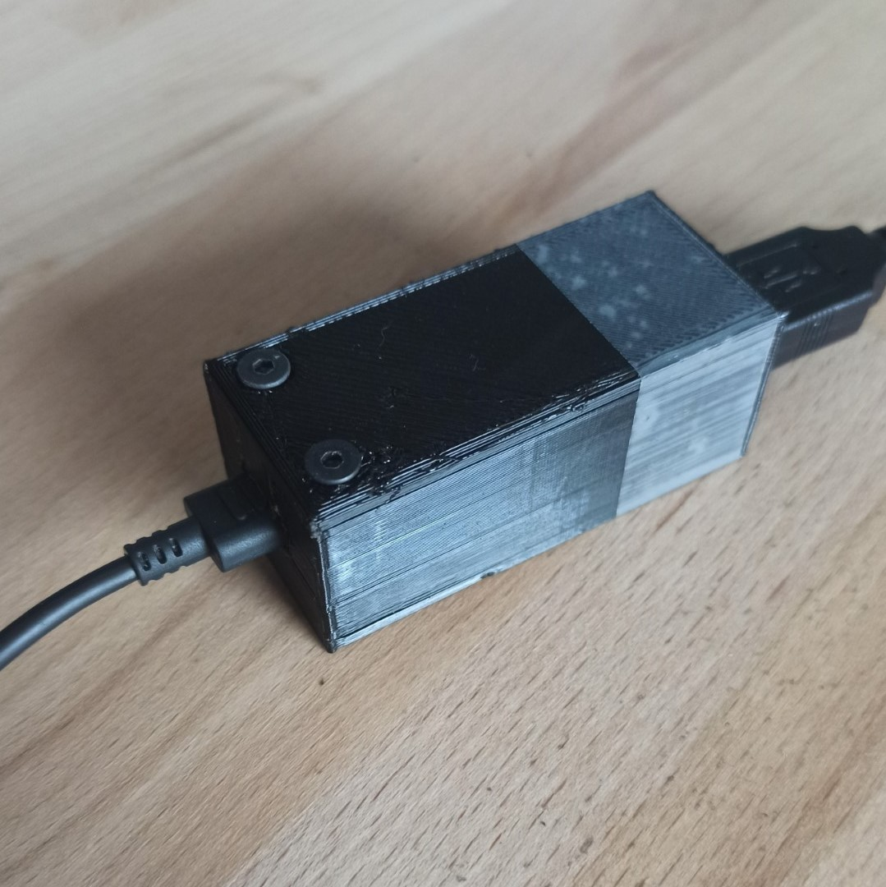

this is an ARDUINO bluetooth keylogger for US and FR keyboard layouts (PS2 compatibles keyboards only), using the Arduino pro micro and the HC-05

Everything written on the keyboard (including Shift Alt Ctrl etc...) is sent via bluetooth to the device connected to the HC-05
You can also send keypresses and text to be written like a real keyboard

For the french keyboard I used [this](https://github.com/matthgyver/Arduino-Keyboard-FR/tree/fix-issue-2) library, adding the new ISO 8859-1 characters of the french keyboard

- Tested on windows QWERTY settings for "bluetoothKeyloggerUS"
- Tested on windows AZERTY settings for "bluetoothKeyloggerFR"

You can find the wiring diagram to make your own, I mounted the component the way they take the less space like so

and in the more vertical way possible so it ressembles a dongle

I also 3d printed a case just the correct size to secure it in

_the additional screw you can see is just here to stall the usb female, preventing it from sticking out when unplugging the keyboard_